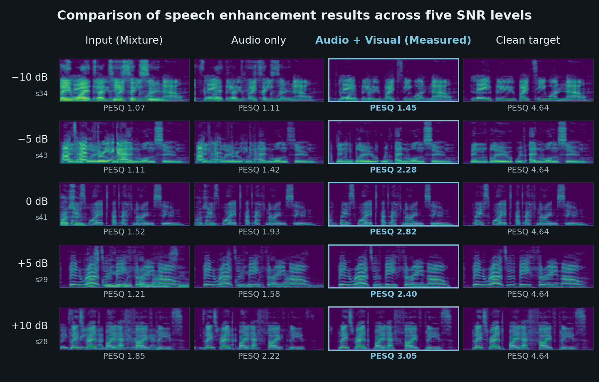
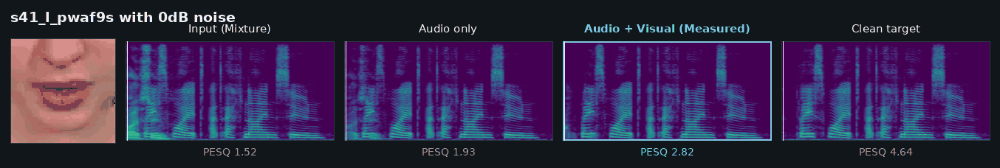

# Audio-Visual Speech Enhancement Dataset with a Focus on Interfering-Talker Mixtures

Audio-visual speech enhancement (AVSE) leverages video of a talker's face
alongside audio. Visual cues matter most when the interference is another voice.
Typical background noise differs from the target in its spectro-temporal
structure, but interfering talkers share it — leaving insufficient acoustic cues
to identify the target. Lip movements provide the missing cue.

This repository provides a pipeline for constructing a dataset focused on this
scenario: clean target speech, video of the talker, and an interfering talker
mixed at five fixed SNR levels. A background-noise condition is included for
comparison.

| | source | license |
| --- | --- | --- |
| Clean speech and video | [Lombard GRID](https://spandh.dcs.shef.ac.uk/avlombard/) | CC BY 4.0 |
| Interfering-speaker noise | other utterances from Lombard GRID | CC BY 4.0 |
| Typical background noise | [CHiME2](https://catalog.ldc.upenn.edu/LDC2017S10) | LDC user agreement |

**What is here, and what is not.** Anything derived from Lombard GRID can be
redistributed, so the interfering-speaker examples are included. The CHiME2
agreement does not permit it: it allows non-commercial research use but no
redistribution outside the licensee's own research group, and that extends to
anything derived from it. So
the typical-background-noise mixtures are absent — but the code that builds them is here
unchanged, and anyone holding the CHiME2 license can produce that half.

## AVSE results and Listening demo

The four panels are:

| panel | what it holds |
| --- | --- |
| Input (Mixture) | the target talker and the interfering talker together |
| Audio only | what a network trained without video recovers from that mixture |
| Audio + Visual (Measured) | what the same mixture becomes when the network can also watch the target talker's mouth |
| Clean target | the recording before anything was mixed into it |

In the Audio + Visual panel the interfering talker's harmonics thin out while
the target's harmonics come through clearly.

All five levels, from the interferer 10 dB louder than the target to 10 dB
quieter:






> [!TIP]
> **To hear any of this, open the live page:** https://ivllcm.github.io/release/
> The figures above are stills of that page, for readers who only have the rendered README.

## Worked examples

`examples/` holds three examples. Each is one target talker, one interfering
talker, and the same pair mixed at all five SNRs:

```
examples/example-1/
  target_s41_l_pwaf9s.wav        the speech to be enhanced
  target_lip.mp4                 that talker's mouth, 64 x 64 at 25 fps
  interferer_s54_l_lwwo5s.wav    a different talker, after the time shift
  mixture_m10dB.wav              target + interferer at -10 dB
  mixture_m5dB.wav                                       -5 dB
  mixture_0dB.wav                                         0 dB
  mixture_5dB.wav                                        +5 dB
  mixture_10dB.wav                                      +10 dB
```

These are rendered from a single pair so that moving down the five files
changes only the level. The corpus itself redraws the interferer at every SNR —
see *How a mixture is made* below.

## How the dataset is put together

**Overall.** The Lombard GRID corpus yields 5,383 usable utterance–video pairs.
`split.py` divides them into **4,843 utterances for the training set** and
**540 for the dev and test sets**. `mix_noise.py` then walks a list and mixes
each utterance with interference: half the utterances are mixed with another
utterance drawn at random from the same list, and half with typical background
noise drawn at random from the noise dataset. The dev and test sets are both built
from the same 540 utterances, which are held out of training — so they share
their clean speech but carry different interference.

**Lip movement crop.** `lip_make.py` takes a fixed 180 × 180 window at the
center of each 720 × 480 frontal video, offset per talker, and writes it as a
64 × 64 MP4 at 25 fps.

**How a mixture is made.** For a target utterance and a chosen SNR:

1. **Draw an interferer.** Another utterance from the same list, picked
   uniformly at random.
2. **Shift it in time.** One of six operations at random: pad or trim its head
   by 4,000 / 8,000 / 16,000 samples (0.25 / 0.5 / 1.0 s). Then trim or
   zero-pad it to the target audio's length.
3. **Scale it to the SNR.**

   ```
   g = sqrt( mean(target²) / ( mean(interferer²) · 10^(snr/10) ) )
   ```

4. **Add.** `mixture = target + g · interferer`, at −10, −5, 0, +5 and +10 dB.

The interferer is drawn inside the SNR loop, so an utterance's five stored
mixtures each carry a different interfering talker — they are five samples, not
one scene at five levels. 

## Dataset size

| list | utterances | Lombard | plain | talkers |
| --- | ---: | ---: | ---: | ---: |
| `train.list` | 4,843 | 2,425 | 2,418 | 54 |
| `dev.list` | 540 | 270 | 270 | 54 |

Every talker appears in both lists: the split separates utterances, not voices.
Each utterance then yields five mixtures, one per SNR.

| set | interfering-speaker noise | typical background noise |
| --- | --- | --- |
| train | 2,421 utterances → 12,105 mixtures | 2,422 → 12,110 |
| dev | 270 utterances → 1,350 mixtures | 270 → 1,350 |
| test | 270 utterances → 1,350 mixtures | 270 → 1,350 |

## Building the dataset

**Preparation.** From https://spandh.dcs.shef.ac.uk/avlombard/, download the
audio for every talker into one folder, and the frontal video for every talker
into another.

```bash
cd <this repository>
CORPUS=/path/to/lombardgrid     # holds audio/ and front/
NOISE=/path/to/CHiME2/dev/0dB   # holds noisy/ and clean/
```

### `split.py` — divide the utterances

Groups files by talker and speaking style — `s10_l_bbat9p.wav` is talker `s10`,
style `l` (Lombard) or `p` (plain), so 54 talkers × 2 styles = 108 groups. Draws
five utterances per group for the dev/test list and leaves the rest for
training.

| argument | |
| --- | --- |
| `--audio-dir` | the corpus `audio/` (required) |
| `--out-dir` | where `dev.list` and `train.list` go (required) |
| `--exclude` | utterances to drop from the corpus; see `scripts/excluded.txt` |
| `--exclude-first` | drop them before the draw rather than after |
| `--seed` | the draw is seeded with this |
| `--path-prefix` | prefix written into the lists, `./audio` by default |

```bash
python scripts/split.py --audio-dir $CORPUS/audio --out-dir out/lists \
    --exclude scripts/excluded.txt --exclude-first
```

### `lip_make.py` — extract the lip movement

Crops the fixed 180 × 180 window and writes 64 × 64 MP4 at 25 fps. Four of the
corpus videos are corrupt and fail here; those are the files `scripts/excluded.txt`
removes at the split step.

| argument | |
| --- | --- |
| `--front-dir` | the corpus `front/` (required) |
| `--out-dir` | where the crops go (required) |
| `--limit` | only the first N videos; omit for all of them |

```bash
python scripts/lip_make.py --front-dir $CORPUS/front --out-dir out/lip --limit 12
```

### `mix_noise.py` — build the mixtures

Takes a list and mixes it at −10, −5, 0, +5 and +10 dB. Even-numbered
utterances in the list are mixed with typical background noise, odd-numbered ones with
another utterance from the Lombard GRID corpus.

> **Note.** A noise dataset is required for both conditions, not only the
> typical background noise one: the noise file drawn for an utterance supplies
> the pairing id that appears in every output filename.
> Any suitable public noise dataset can stand in for CHiME2 here.

| argument | |
| --- | --- |
| `--lists` | the utterance lists, training first |
| `--audio-root` | the corpus root the list paths are relative to |
| `--out-dir` | one per list; each receives a `clean/` and a `noisy/` (required) |
| `--noise-noisy` / `--noise-clean` | the typical background noise directories |
| `--seed` | seeds every draw the generator makes |

All three sets come out of one invocation:

```bash
python scripts/mix_noise.py \
    --lists out/lists/train.list out/lists/dev.list out/lists/dev.list \
    --audio-root $CORPUS \
    --out-dir out/train out/dev out/test \
    --seed 1111 \
    --noise-noisy $NOISE/noisy --noise-clean $NOISE/clean
```

`dev.list` appears twice on purpose. The seed is set once at the start and the
random stream runs on through the whole invocation, so by the time the third
pass begins it has advanced well past where the second began — the same 540
utterances come back paired with entirely different interference. That is what
makes the dev and test sets differ.

Two consequences follow from the same fact. The lists must be given in one
invocation and in a fixed order, since each pass depends on the stream the
previous one left behind. And a list must not be truncated: the pool an
interferer is drawn from is the list itself, so removing lines changes the
draws for the lines that remain.

## Repository layout

```
.
├── examples/          three worked examples, one pair each at five SNRs
├── scripts/
│   ├── split.py       corpus → train and dev/test utterance lists
│   ├── lip_make.py    frontal video → 64 x 64 lip video
│   ├── mix_noise.py   utterance lists → mixtures
│   └── excluded.txt   utterances dropped from the corpus, with the reason for each
├── docs/
│   ├── index.html     the listening demo
│   ├── media/         its audio, video and spectrograms
│   ├── demo.gif       the animation at the top of this page
│   └── preview.png    the five-level grid above
├── LICENSE
└── CITATION.cff
```

Audio is 16 kHz, mono, 16-bit PCM WAV. Video is 64 × 64, 25 fps, MP4.

## Provenance and license

Speech, video and talker metadata come from the **Lombard GRID** corpus,
released under **Creative Commons Attribution 4.0 International**:

> Alghamdi, N., Maddock, S., Marxer, R., Barker, J., & Brown, G. J. (2018).
> A corpus of audio-visual Lombard speech with frontal and profile views.
> *The Journal of the Acoustical Society of America*, 143(6), EL523–EL529.
> https://doi.org/10.1121/1.5042758

**Changes made to that source material**, as CC BY 4.0 requires them to be
stated:

- audio re-encoded from 32-bit float to 16-bit PCM (sample rate unchanged at 16 kHz)
- utterances additively mixed with other utterances from the same corpus
- video cropped to a fixed 180 × 180 lip region, resized to 64 × 64, re-encoded to 25 fps MP4
- utterances partitioned into training and evaluation lists

Only the lip region is redistributed, never the full-frame face.

This release is likewise **CC BY 4.0** — see `LICENSE`.
